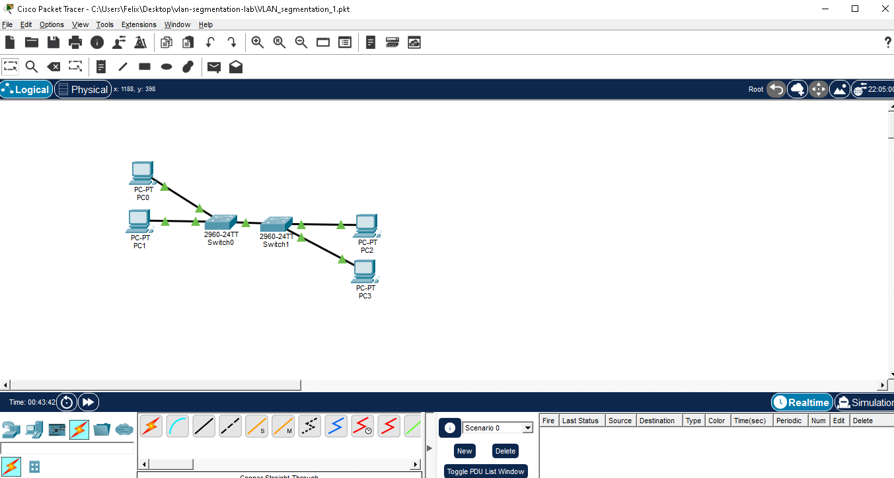
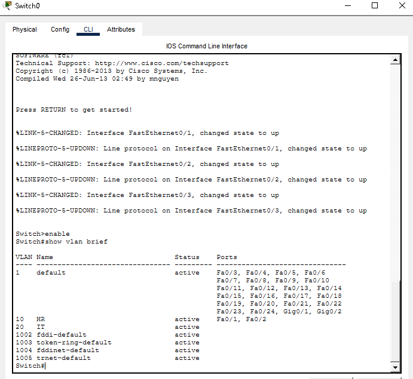
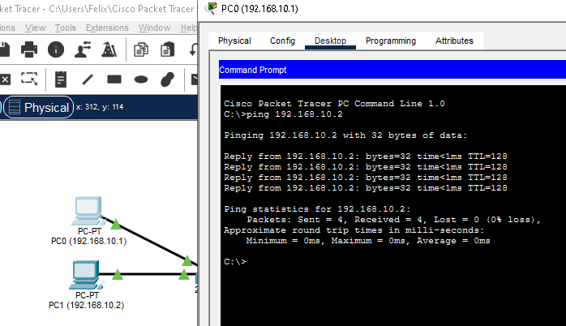
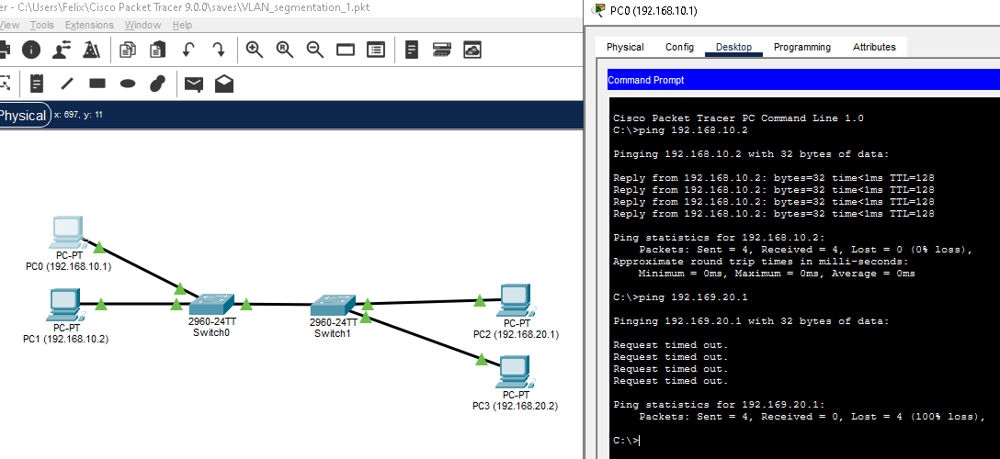

# VLAN Segmentation and Layer 2 Isolation Lab

## Overview

This project demonstrates VLAN segmentation and Layer 2 isolation using Cisco Packet Tracer.

Two switches were connected using a trunk link, and devices were assigned to separate VLANs to restrict communication between departments.

## Objectives

- Create VLAN 10 (HR)
- Create VLAN 20 (IT)
- Configure access ports
- Configure trunk links
- Verify VLAN isolation

## VLAN Assignment

| Device   | VLAN    |
|----------|---------|
| PC0      | VLAN 10 |
| PC1      | VLAN 10 |
| PC2      | VLAN 20 |
| PC3      | VLAN 20 |

## Tools Used

- Cisco Packet Tracer

## Results

Devices within the same VLAN communicated successfully.

Devices in different VLANs were unable to communicate, confirming Layer 2 isolation.

## Key Concepts Learned

- VLAN Segmentation
- Layer 2 Isolation
- Trunking
- Broadcast Domain Separation

## Screenshots

Network Topology

VLAN Configuration

Successful Ping Test

Failed Ping Test

## What I Learned

Through this lab, I learned how VLANs can logically separate devices on the same physical network. I configured VLAN 10 HR and VLAN 20 IT on both switches so that traffic from both VLANs could pass through a trunk link. I also learned that VLAN tags act like labels on the traffic, helping switches identify which VLAN the data belongs to and maintain separation between different VLANs.

I also learned that assigning devices to different VLANs creates Layer 2 isolation. Although all devices are connected through the same network infrastructure, devices in VLAN 10 cannot directly communicate with devices in VLAN 20 without additional configuration or routing. This helps improve network organization and security by separating traffic between departments.

